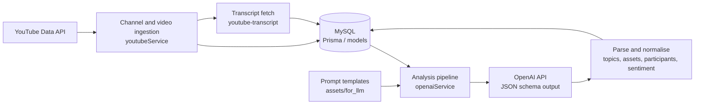

# yt-fin-analytics

A TypeScript pipeline that ingests YouTube videos from finance and crypto channels, fetches their transcripts, and analyses them with an OpenAI model to produce structured JSON (topics, keywords, mentioned assets, participants, sentiment). Results are stored in MySQL.

> Reference code, not audited. The repository is a snapshot of work in progress: the data layer was being migrated from Sequelize models (`src/models/`) to Prisma (`prisma/schema.prisma`), so the project does not compile as-is (missing `sequelize`/`openai`/`youtube-transcript`/`md5` dependencies and a `config/database` module). Treat it as an architecture and prompt-design reference.

## Architecture

## Stack

- TypeScript on Node.js (ts-node)
- MySQL with Prisma (`prisma/schema.prisma`) and Sequelize-style models (legacy, `src/models/`)
- OpenAI SDK for LLM analysis with a JSON schema response format
- YouTube Data API v3 and `youtube-transcript`
- Express and CORS are listed as dependencies but no HTTP server exists in this snapshot

## Setup

1. `npm install`
2. `cp .env.example .env` and fill in the values
3. `npx prisma db push` (or migrate) and `npm run db:seed` to load config and prompt templates from `assets/for_llm/`
4. Run the driver: `npm run cli -- <channel|videos|titles|transcripts|analyse>`

## Environment variables

| Variable | Purpose |
|---|---|
| `DATABASE_URL` | MySQL connection string used by Prisma |
| `OPENAI_API_KEY` | OpenAI API key |
| `OPENAI_MODEL_ID` | Model used for analysis |
| `OPENAI_MODEL_TOKEN_LIMIT` | Context token limit of the model |
| `OPENAI_MODEL_COMPLETION_MAX_TOKEN` | Max completion tokens |
| `YOUTUBE_DATA_API_KEY` | YouTube Data API key |
| `YOUTUBE_API_BASE_URL` | YouTube API base URL |
| `YT_CHANNEL_HANDLE` | Channel handle for the `channel` command |
| `YT_UPLOADS_PLAYLIST_ID` | Uploads playlist ID for the `videos` command |
| `YT_VIDEO_ID` | Video ID for the `analyse` command |

## Breaking changes from the original private project

- The hardcoded channel handle, playlist IDs and video ID in `index.ts` are replaced by the `YT_*` variables above plus a CLI command argument.
- The package was renamed to `yt-fin-analytics`; the original database name was replaced by the neutral `analytics_db`. Existing deployments must update their `DATABASE_URL`.
- The `dev`/`start` scripts referencing a non-existent `src/server.ts` were removed; use `npm run cli`.
- Old MySQL dumps, the legacy SQL create script and two dead service files were removed from history.

## Context

Built in 2024 as an experiment in correlating video sentiment with market moves. The correlation and price-data components described in early notes were never implemented. Sample prompt data in `assets/for_llm/` uses fictional names.

## Disclaimer

Reference code, not audited. Not financial advice. Scraped third-party content (transcripts, titles) is subject to YouTube's terms and copyright; do not redistribute it.

## Notice

Third-party packages retain their own licences. The code in this repository is released under the MIT licence (see `LICENSE`).
